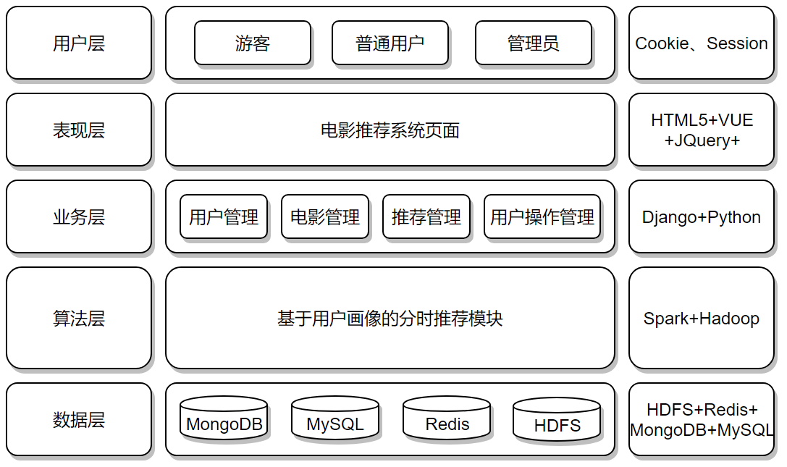

# BiSheServer

### 1、项目介绍
> 本系统为我的本科毕业设计项目，毕设题目为“基于用户画像的电影推荐系统的设计与实现”。

> 本系统是以Django作为基础框架，采用MTV模式，数据库使用MongoDB、MySQL和Redis，以从豆瓣平台爬取的电影数据作为基础数据源，主要基于用户的基本信息和使用操作记录等行为信息来开发用户标签，并使用Hadoop、Spark大数据组件进行分析和处理的推荐系统。管理系统使用的是Django自带的管理系统，并使用simpleui进行了美化。

> 欢迎各位继续完善、改进该系统，遇到问题可提 Issues，或直接发邮件、QQ联系我。

### 2、系统架构图


### 3、系统模块图


### 4、目录结构及主要文件说明
```
├─BiShe
│  ├─admin.py                           （Django后端管理系统主要配置）
│  ├─views.py      	                    （各个页面访问调用）
│  └─urls.py                            （各个页面访问地址）
│
├─BiSheServer
│  ├─settings.py                        （Django主要配置文件）
│  └─urls.py                            （一级地址处理地址）
│
├─config                                （配置文件存放目录）
│  └─conf.ini                           （本系统主要配置文件）
│
├─spark
│  ├─jars                               （MySQL连接jar包）
│  └─spark.py                           （Spark处理用户画像，可独立）
│
├─movie
│  ├─models.py                          （电影模型配置，对应数据库表）
│  ├─views.py                           （电影的api接口）
│  └─urls.py                            （二级movie地址配置）
│
├─user
│  ├─models.py                          （用户模型配置，对应数据库表）
│  ├─views.py                           （用户的api接口）
│  └─urls.py                            （二级user地址配置）
│
├─api                              （api文件夹）
│  ├─api.py                             （其他API）
│  ├─movie_api.py                       （电影操作api）
│  ├─user_api.py                        （用户操作api）
│  ├─crontab.py                         （配置包）
│  ├─captcha.py                         （生成验证码api）
│  ├─delay_work.py                      （使用线程修改标签）
│  ├─districts.py                       （查询区域地址api）
│  ├─email.py                           （邮箱发送邮件api）
│  ├─email_vail.py                      （邮件发送前的验证）
│  ├─middleware_log.py                  （自定义日志中间件）
│  ├─MidnightRotatingFileHandler.py     （线程安全日志切割配置）
│  ├─model_json.py                      （数据库查询结果转换）
│  ├─redis_pool.py                      （Redis连接池）
│  ├─models.py                          （中国省市地区表、首页轮播图表）
│  ├─response.py                        （api统一格式化响应）
│  ├─set_var.py                         （模板配置set变量操作符）
│  ├─upload_log.py                      （上传系统日志文件）
│  ├─urls.py                            （api响应地址配置）
│  └─views.py                           （404、500错误页面配置）
│
├─log                                   （日志文件存放临时目录）
├─static                                （静态文件存放目录）
├─templates                             （页面模板文件存放目录）
└─requirements.txt                      （依赖安装需求库文件）
```

### 5、配置文件说明
    ;系统配置 必需配置
    [DEFAULT]
    ;是否启用调试服务
    DEBUG = True
    ;是否启用日志系统
    USE_LOG = False
    ;允许访问的地址
    ALLOWED_HOSTS = [*]
    ;静态文件目录
    STATIC_HOME = static
    ;日志目录
    LOG_HOME = log/
    ;模板目录
    TEMPLATES_HOME = templates
    ; 设置允许上传的文件格式
    ALLOW_EXTENSIONS = ['png', 'jpg', 'jpeg']
    ; 设置允许上传的文件大小，B字节为单位
    ALLOW_MAXSIZE = 5242880
    ;头像文件存放地址
    AVATARS_UPLOAD_FOLDER = static/images/avatars/
    
    ;MySql数据库配置 必需配置
    [DATEBASE]
    ;数据库引擎驱动
    DATABASES_ENGINE = django.db.backends.mysql
    ;数据库名称
    DATABASES_NAME = sql_bs_sju_site
    ;数据库链接地址
    DATABASES_HOST = 127.0.0.1
    ;数据库端口
    DATABASES_PORT = 3306
    ;数据库用户名
    DATABASES_USER = sql_bs_sju_site
    ;数据库密码
    DATABASES_PASSWORD = xzDPV7JL79w3Epg
    
    ;Redis数据库配置  必需配置
    [REDIS]
    ;数据库地址
    REDIS_HOST = 127.0.0.1
    ;数据库端口号
    REDIS_PORT = 6379
    ;数据库连接密码
    REDIS_PASSWORD = 123456
    ;数据库存放的库号
    REDIS_DB = 2
    
    ;邮件验证系统配置  可选配置
    [EMAIL]
    ;是否使用邮箱验证服务，False为关闭时将不会真实发送邮件验证，True为启用
    EMAIL_USE = False
    ;邮件服务器地址
    EMAIL_HOST = smtpdm.aliyun.com
    ;邮件服务登录账号
    EMAIL_USER = admin@bishe.com
    ;邮件服务账号密码
    EMAIL_PASSWORD = 123456
    
    ;Hadoop配置  可选配置
    [HADOOP_LOG]
    ;Hadoop链接地址
    HADOOP_HOST = 172.17.183.81
    ; 客户端连接的目录
    ROOT_PATH = /sys_data_log
    ; HDFS上的路径，注意，需要先在hdfs手动创建此目录
    REMOTE_PATH = /sys_data_log
    ; 本地路径，建议写绝对路径，例如：E:\my_work\测试目录  "D:/tmp/output"
    LOCAL_PATH = log/
    ;日志后缀格式，同时也会根据其进行切片
    ;按日切%Y-%m-%d  按月切%Y-%m  按小时切%Y-%m-%d_%H
    LOG_SUFFIX = %Y-%m-%d


### 6、安装配置说明
    当外部配置完成后，可将本系统根目录中config/conf.ini文件打开，然后修改其中的配置。首先是系统的默认配置服务、MySql数据库配置、Redis数据库配置、邮件验证系统配置和Hadoop等配置。
    
    在项目目录运行命令，创建表结构，同时创建Django管理系统的管理员帐号：
    python manage.py makemigrations user movie api
    python manage.py migrate
    python manage.py createsuperuser
    下载基础数据：
        链接: https://pan.baidu.com/s/1XJTnuCVlDvbUG3zp4kk-Ag 提取码: ik32
    导入基础数据，登陆进入mysql控制台，并通过source 命令调用sql文件，如：（此处的sql文件为上面下载的三个基础数据文件）
    mysql –uroot –p123456 -Dtest
    mysql> source sys.sql
    上述所有工作都准备完成后使用命令启动该系统服务：python manage.py runserver 0.0.0.0:8001
    （8001为端口号，可根据需求更换，0.0.0.0表示所有主机都可访问，若设置为127.0.0.1，则表示只可本地访问）
    
    离线处理（可选部分）
    将项目目录下spark/jars文件夹中的mysql-connector-java-8.0.24.jar文件复制到spark的jars目录下。
    修改spark目录下的spark.py文件中的spark配置和mysql配置，将其上传到Linux下，加入Linux定时任务每日执行。运行命令：python3 ./spark.py   ，即可每日自动处理离线数据，精准推荐，推荐方式同时包含基于电影内容（基于内容）、基于用户相似度（基于协同过滤）推荐的方式。后期如有兴趣的同学还可完善改为实时推荐。
    
    同系统安装说明书里的Hadoop、Spark组件都是可选部分，只用于离线处理部分，不安装也可运行整个系统

### [7、系统安装使用说明书](电影推荐系统的实现效果.pdf)

### [8、系统实现效果](基于用户画像的电影推荐系统.pdf)

### 9、注意：
	1.数据库需用5.6以上的mysql版本；
	2.Python用3.7；
	3.mysql字符集使用UTF-8；
	4.user_usersbase表中id为2的账号为访客通用账号，不可移除；
	5.导入的账号密码为：Zero  123456；
	6.数据库所有电影数据以movie_collectmoviedb表中电影数据为基础，用户数据以	user_usersbase为基础，导入数据必须先导入这两张表，其余数据后导，删除数据时则相反，需先删除关联其的数据最后再删该表数据。

### 9、常见错误：
```
  File "D:\app\Python\Python37\lib\importlib\__init__.py", line 127, in import_module
    return _bootstrap._gcd_import(name[level:], package, level)
  File "D:\app\Python\Python37\lib\site-packages\django\db\backends\mysql\base.py", line 37, in <module>
    raise ImproperlyConfigured('mysqlclient 1.3.13 or newer is required; you have %s.' % Database.__version__)
django.core.exceptions.ImproperlyConfigured: mysqlclient 1.3.13 or newer is required; you have 0.9.3.

遇见此错误时，找到对应代码文件中的判断版本的两行代码，前面加注释“# ”，忽略错误。
```

### 10、开源许可
- [Apache-2.0 License](https://github.com/HuQi2018/BiSheServer/blob/master/LICENSE)
- **如有引用和转载，请注明出处**

### 11、引用参考
- [recommenderSystemBasedOnSpark](https://github.com/toughhou/recommenderSystemBasedOnSpark)

